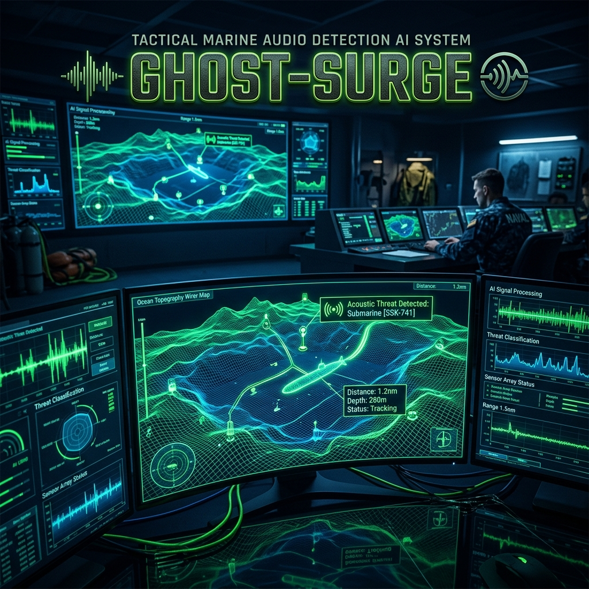
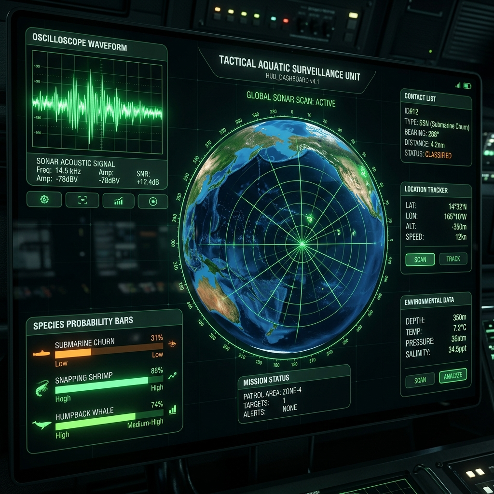
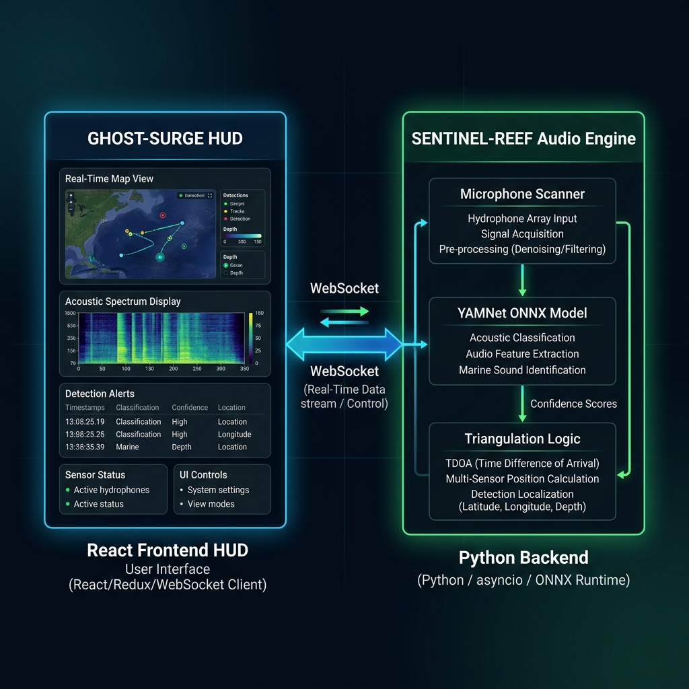

<div align="center">
  
  
  # GHOST-SURGE & SENTINEL-REEF 🌊
  
  **Tactical Marine Acoustic AI & HUD Orchestration System**
  
  [](https://reactjs.org/)
  [](https://vitejs.dev/)
  [](https://www.python.org/)
  [](https://www.tensorflow.org/)
</div>

<br />

> **GHOST-SURGE** is an advanced tactical Heads-Up Display (HUD) and command center interface, tightly integrated with **SENTINEL-REEF**, an AI-powered underwater acoustic analysis bridge. Together, they provide real-time marine threat detection, species classification, and 3D triangulation visualizations.

---

## 🚀 Key Features

### 💻 Frontend (Ghost-Surge Tactical HUD)
- **3D Bathymetric Globe:** A perfectly scaled, immersive interactive Earth model integrated via `@splinetool/loader`.
- **Live Oscilloscope:** Real-time waveform visualization streamed directly from the Python backend via WebSockets.
- **Species Classification Panel:** Dynamic probability bars identifying acoustic anomalies like *Submarine Churn, Snapping Shrimp, and Humpback Whales*.
- **Tactical Grid:** Interactive command modules including Forensic Analysis, SIGINT (Signals Intelligence), and Bathymetric Sensors.
- **Cinematic Matrix-Green Aesthetic:** High-fidelity custom CSS filters, uneven typewriter text animations, and glassmorphism styling.

### 🧠 Backend (Sentinel-Reef Audio Engine)
- **YAMNet Neural Engine:** Utilizes Google's YAMNet ONNX model trained on AudioSet to classify over 521 audio classes in real-time.
- **WebSocket Streaming:** A low-latency bridge capable of processing audio and continuously dispatching signal amplitudes and probabilities to the frontend.
- **Triangulation Logic:** Advanced simulated Time Difference of Arrival (TDOA) logic for mapping acoustic anomalies.

---

## 🛠️ Project Architecture

The repository is structured into a clean `frontend/` and `backend/` separation, bridged seamlessly via a central orchestrator.

```text
📦 Ghost-Surge-Unified
 ┣ 📂 backend                 # Python Audio Engine
 ┃ ┣ 📂 audio_engine          # Contains WAV test files, mic scanner, YAMNet model
 ┃ ┣ 📂 triangulation_logic   # TDOA math formulas
 ┃ ┗ 📜 sentinel_bridge.py    # Main WebSocket Server
 ┣ 📂 frontend                # React/Vite HUD
 ┃ ┣ 📂 src                   # Components (CommandHUD, LandingPage, Bathymetric)
 ┃ ┗ 📜 package.json          # Node dependencies
 ┗ 📜 main_orchestrator.py    # Master Boot Script
```

---

## ⚙️ Getting Started

### Prerequisites
- **Node.js** (v18+)
- **Python** (v3.10+)
- `pip` and `npm` installed.

### 1️⃣ Setup Dependencies

**Backend:**
```bash
cd backend/audio_engine
pip install -r requirements.txt # (ensure you have numpy, websockets, onnxruntime, sounddevice)
```

**Frontend:**
```bash
cd frontend
npm install
```

### 2️⃣ Launch the System
To spin up both the **Sentinel-Reef AI Bridge** and the **Ghost-Surge UI**, simply run the unified master script from the root of the project:

```bash
python main_orchestrator.py
```

### 3️⃣ Access the HUD
Once the master script executes successfully, it will display the status of both nodes:
- **AI Backend Bridge:** `ws://localhost:8000`
- **Tactical HUD:** `http://localhost:3000`

Open `http://localhost:3000` in your browser.

---

## 📡 Simulating Anomalies

The UI allows for active engagement. You can click on the **Triangulation Grid** or select different **Audio Signatures** from the HUD to swap the live data stream fed by the Python backend.

- **`SUBMARINE CHURN`**: Low-frequency hums and cavitation.
- **`HUMPBACK WHALE`**: High-frequency marine mammal communications.
- **`SHRIMP SHRIKE`**: Sharp, crackling acoustic profiles.

---

<div align="center">
  <p><i>Classified Level 5 Operational Toolkit. Unauthorized access is strictly logged.</i></p>
</div>

---

## 🖥️ HUD Preview

<div align="center">
  
  <p><sub>The Ghost-Surge Tactical HUD — live species classification, oscilloscope, and 3D globe running simultaneously.</sub></p>
</div>

---

## 🔌 System Architecture

<div align="center">
  
</div>

### Data Flow

```
  [ Microphone / WAV File ]
          │
          ▼
  [ sentinel_bridge.py ]  ──── YAMNet ONNX ────►  521-class Audio Classifier
          │
          │   WebSocket (ws://localhost:8000)
          ▼
  [ Ghost-Surge React HUD ]
     ├── Live Oscilloscope Waveform
     ├── Species Probability Bars
     ├── Forensic Analysis Panel
     └── SIGINT + Bathymetric Modules
```

---

## 🧩 Module Breakdown

### Frontend Modules (`frontend/src/`)

| Module | Description |
|---|---|
| `LandingPage.tsx` | Animated cinematic landing with typewriter headline and 3D Earth |
| `CommandHUD.tsx` | Main operational dashboard — oscilloscope, species bars, grid |
| `ForensicAnalysis.tsx` | Deep-dive panel for acoustic forensic playback and event logs |
| `Sigint.tsx` | Signals Intelligence module — frequency spectrum analysis |
| `Bathymetric.tsx` | Ocean depth mapping visualization module |
| `Sensors.tsx` | Hydrophone sensor network health dashboard |
| `AnomalyLog.tsx` | Time-series log of all detected anomalies |
| `TacticalContext.tsx` | Global state management for real-time data streams |
| `Layout.tsx` | Navigation shell and persistent HUD frame |
| `SettingsAccount.tsx` | Operator profile and account management |
| `SettingsSecurity.tsx` | Authentication and access-control configuration |
| `SettingsAppearance.tsx` | Theme, color filter, and HUD density controls |

### Backend Modules (`backend/`)

| Module | Description |
|---|---|
| `audio_engine/sentinel_bridge.py` | Core WebSocket server — streams amplitude arrays and class probabilities |
| `audio_engine/yamnet.onnx` | Google YAMNet model (~15MB) — classifies 521 audio classes |
| `audio_engine/yamnet_class_map.csv` | Label map for translating model output indices to class names |
| `audio_engine/mic_scanner.py` | Utility to enumerate all available microphone devices |
| `triangulation_logic/tdoa.py` | Time Difference of Arrival (TDOA) math engine |
| `main_orchestrator.py` | Master launch script — boots both backend and frontend together |

---

## 📶 WebSocket Protocol

The backend sends JSON frames at ~10Hz to all connected HUD clients. Each frame is structured as:

```json
{
  "amplitudes": [0.12, 0.45, 0.33, ...],
  "probabilities": {
    "Snapping Shrimp":   0.72,
    "Humpback Whale":    0.15,
    "Submarine Churn":   0.08,
    "Submarine Hum":     0.05
  },
  "source": "SUBMARINE_CHURN",
  "timestamp": 1746760412.33
}
```

The HUD consumes this stream and renders all panels in a single synchronized frame via React state.

---

## 🏗️ Tech Stack

<div align="center">

| Layer | Technology | Purpose |
|---|---|---|
| **HUD Frontend** | React 19 + Vite 6 | Component-based real-time UI |
| **Styling** | Tailwind CSS 4 + Custom CSS | Matrix-green theme, glassmorphism |
| **3D Engine** | Spline / Three.js | Interactive Earth model |
| **Animations** | Framer Motion | Cinematic panel transitions |
| **AI Model** | YAMNet ONNX | 521-class audio classifier |
| **Inference** | ONNX Runtime (Python) | CPU-based local inference |
| **Audio I/O** | SoundDevice (PyAudio) | Microphone capture |
| **Transport** | WebSockets (Python) | Low-latency streaming |
| **Orchestration** | Python subprocess | Unified one-command boot |

</div>

---

## 🔊 Supported Audio Signatures

| Signal | Frequency Profile | Threat Level |
|---|---|---|
| 🦐 **Snapping Shrimp** | Broadband impulsive noise | ⬜ Benign |
| 🐋 **Humpback Whale** | 80Hz–4kHz tonal / harmonic | ⬜ Marine Life |
| 🌊 **Reef Ambient** | Continuous broadband | ⬜ Background |
| ⚙️ **Submarine Churn** | 10–200Hz low-freq cavitation | 🟥 THREAT |
| 🛥️ **Submarine Motor** | Narrowband tonal 50–300Hz | 🟥 THREAT |
| 🔇 **Silence / Unknown** | No dominant frequency | 🟨 Unclassified |

---

## 🤝 Contributing

Contributions are welcome. To contribute:

1. Fork this repository.
2. Create a feature branch: `git checkout -b feature/my-feature`
3. Commit your changes: `git commit -m 'feat: add my feature'`
4. Push: `git push origin feature/my-feature`
5. Open a Pull Request.

Please keep to the neon green aesthetic and avoid introducing external UI libraries that conflict with the existing Tailwind + custom CSS setup.

---

## 📜 License

This project is MIT licensed. See `LICENSE` for details.

---

<div align="center">
  
  <br/>
  <sub>Built with 🌊 and classified-level engineering. <b>GHOST-SURGE</b> — The ocean doesn't lie.</sub>
</div>
